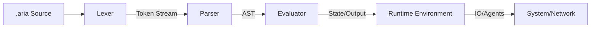

# aria-lang: Runtime Architecture Research

## Evaluation of Runtime Options

| Feature | Node.js | Rust | Zig |
| :--- | :--- | :--- | :--- |
| **Development Speed** | Excellent (High-level, huge ecosystem) | Good (Steep learning curve, but great tooling) | Moderate (Low-level, manual memory) |
| **Execution Performance** | Good (V8 JIT) | Excellent (Native, Zero-cost) | Excellent (Native, Precise control) |
| **Safety** | High (GC, Managed) | Exceptional (Ownership model) | Moderate (Manual memory, but safe defaults) |
| **Parsing Tooling** | Rich (Chevrotain, Ohm) | Rich (Logos, Pest, LALRPOP) | Emerging (Manual or basic generators) |
| **Agent-Ready Feasibility** | High (Easy async/await, JSON) | High (Strong concurrency, Type safety) | Moderate (Requires more manual work for async) |

### Recommendation: Rust
**Rust** is the optimal choice for building `aria-lang` within a 7-day window. It provides the performance of a native language (comparable to Zig) while offering high-level abstractions like Sum Types (Enums) and Pattern Matching that are specifically suited for Tree-Walking or Bytecode Interpreters.

---

## 7-Day Development Roadmap

### Phase 1: Foundation (Days 1-2)
- **Day 1: Lexer & Lexical Grammar.** Implement a robust lexer (using `logos` crate) to tokenize input. Define "Agent-Ready" tokens (e.g., `@` for agent refs, `await` for async flow).
- **Day 2: Parser & AST.** Build a recursive descent parser. Define the Abstract Syntax Tree (AST) using Rust enums. Focus on error resilience (capturing multiple errors instead of bailing).

### Phase 2: Core Execution (Days 3-4)
- **Day 3: The Evaluator (Tree-Walk).** Implement a `Visitor` pattern or direct recursive evaluation for the AST. Handle scopes, variables, and basic control flow (if/else, loops).
- **Day 4: Agent Primitives.** Implement native support for "Promises" or "Futures" that represent agent tasks. Add built-in functions for messaging and context injection.

### Phase 3: Optimization & Polish (Days 5-7)
- **Day 5: Environment & Built-ins.** Build a standard library for file I/O, networking, and JSON handling.
- **Day 6: Performance Tuning.** Profile the interpreter. Move from Tree-Walking to a Bytecode VM if performance targets aren't met (optional stretch goal).
- **Day 7: CLI & Documentation.** Finalize the `aria` CLI tool. Write standard library documentation and example "Agent-Ready" scripts.

---

## High-Level Architecture

### 1. Source Code (`.aria`)
Plain text file containing the logic and agent definitions.

### 2. Lexer (Scanner)
Converts raw text into a stream of **Tokens**. 
- *Input:* `agent bot { say "hello" }`
- *Output:* `[AGENT, IDENT(bot), LBRACE, SAY, STRING("hello"), RBRACE]`

### 3. Parser
Consumes the token stream and produces an **Abstract Syntax Tree (AST)**.
- Uses **Recursive Descent** for simplicity and better error messages.
- The AST is a tree structure where each node represents a language construct (e.g., `Statement::AgentDeclaration`).

### 4. Evaluator (The Engine)
Traverses the AST and executes the logic.
- **Environment Stack:** Manages variable scopes and agent contexts.
- **Runtime Pool:** Handles asynchronous agent tasks and native syscalls.

